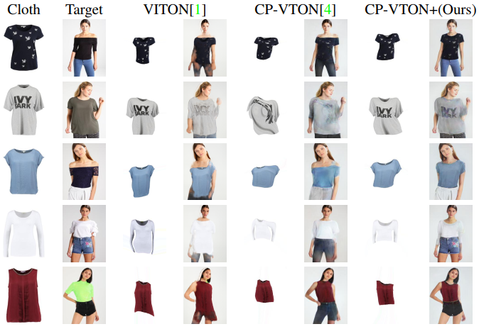

# CP-VTON+ (CVPRW 2020)
Official implementation for "CP-VTON+: Clothing Shape and Texture Preserving Image-Based Virtual Try-On" from CVPRW 2020.
<br/>Project page: https://minar09.github.io/cpvtonplus/. 
<br/>Saved/Pre-trained models: [Checkpoints](https://1drv.ms/u/s!Ai8t8GAHdzVUiQA-o3C7cnrfGN6O?e=gUZQI6)
<br/><br/>

	
## Usage
This pipeline is a combination of consecutive training and testing of GMM + TOM. GMM generates the warped clothes according to the target human. Then, TOM blends the warped clothes outputs from GMM into the target human properties, to generate the final try-on output.

1) Install the requirements
2) Prepare the dataset
3) Train GMM network
4) Get warped clothes for training set with trained GMM network, and copy warped clothes & masks inside `data/train` directory
5) Train TOM network
6) Test/evaluate with test set, test GMM first, then copy warped clothes & masks inside `data/test` directory, and test TOM

## Installation
This implementation is built and tested in PyTorch 0.4.1.
<br/>Run `pip install -r requirements.txt`

## Data preparation
1) Run `python data_download.py`, it will download the full dataset into data/ folder, both train and test.
2) Run `python dataset_neck_skin_correction.py`, twice for both 'train' and 'test' data for training and testing. Please set the correct paths in the script before running. It will add a new segmentation label for neck/skin areas, and save the new segmentation in "image-parse-new" folder. You need to run twice for both train and test data.
3) Run `python body_binary_masking.py`, twice for both 'train' and 'test' data for training and testing. Please set the correct paths in the script before running. It will create the body binary masks for the inputs of the networks. You need to run twice for both train and test data.

## Training
Run `python train.py` with your specific usage options for GMM and TOM stage.
<br/>For example, GMM: ```python train.py --name GMM --stage GMM --workers 4 --save_count 5000 --shuffle```
<br/> Then run test.py for GMM network with the training dataset, which will generate the warped clothes and masks in "warp-cloth" and "warp-mask" folders inside the "result/GMM/train/" directory. Copy the "warp-cloth" and "warp-mask" folders into your data directory, for example inside "data/train" folder.
<br/>Run TOM stage, ```python train.py --name TOM --stage TOM --workers 4 --save_count 5000 --shuffle```

## Testing
Run 'python test.py' with your specific usage options.
<br/>For example, GMM: ```python test.py --name GMM --stage GMM --workers 4 --datamode test --data_list test_pairs.txt --checkpoint checkpoints/GMM/gmm_final.pth```
<br/> Then run test.py for GMM network with the testing dataset, which will generate the warped clothes and masks in "warp-cloth" and "warp-mask" folders inside the "result/GMM/test/" directory. Copy the "warp-cloth" and "warp-mask" folders into your data directory, for example inside "data/test" folder.
<br/>Run TOM stage: ```python test.py --name TOM --stage TOM --workers 4 --datamode test --data_list test_pairs.txt --checkpoint checkpoints/TOM/tom_final.pth```

## Inference/Demo
Download the pre-trained models from here: [Checkpoints](https://1drv.ms/u/s!Ai8t8GAHdzVUiQA-o3C7cnrfGN6O?e=gUZQI6).
Then run the same step as Testing to test our model.

## Citation
Please cite our paper in your publications if it helps your research:
```
@InProceedings{Minar_CPP_2020_CVPR_Workshops,
	title={CP-VTON+: Clothing Shape and Texture Preserving Image-Based Virtual Try-On},
	author={Minar, Matiur Rahman and Thai Thanh Tuan and Ahn, Heejune and Rosin, Paul and Lai, Yu-Kun},
	booktitle = {The IEEE/CVF Conference on Computer Vision and Pattern Recognition (CVPR) Workshops},
	month = {June},
	year = {2020}
}
```

### Acknowledgements
This implementation is largely based on the PyTorch implementation of [CP-VTON](https://github.com/sergeywong/cp-vton). We are extremely grateful for their public implementation.
